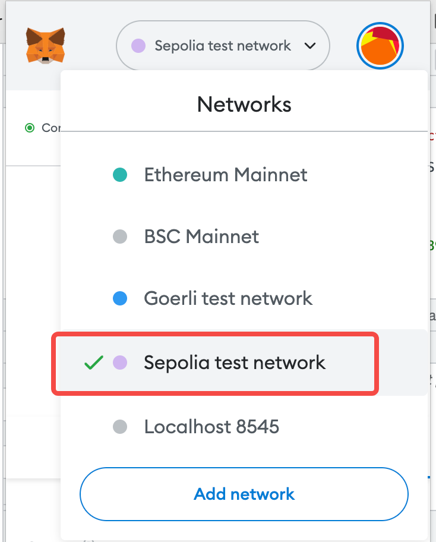

# Web3 project

[](https://app.netlify.com/sites/delightful-valkyrie-f13641/deploys)

## TIP

web3 not work with next@13, pls use next@12.

## How to run

```sh
node ./ethereum/compile.js && npx rimraf .env && KEY=YOUR_KEY node ./ethereum/deploy.js >> .env && yarn dev
```

## Explain

```sh
node ./ethereum/compile.js                        # compile solidity
npx rimraf .env                                   # remove .env file
KEY="YOUR_KEY" node ./ethereum/deploy.js >> .env  # deploy solidity to online eth chain and get the online contract address and wirte down it into .env file.
yarn dev                                          # dev the next-reactjs web app
yarn build && yarn start                          # build and deploy the web app
```

## Preparation

1. install MetaMask Chrome extension

2. This contract will deploy into **Sepolia network**, pls make sure you are already select Sepolia network.

    

3. connect this website

    

4. Prepare your metamask 12 word phrase

## Routers

1. / => campaigns

2. /campaigns/new => create campaign

3. /campaigns/[:address] => campaign details

4. /campaigns/0x02C54A2A5978Dc3367a8a69e0cF242E72BF44162/requests => campaign request list

5. /campaigns/0x02C54A2A5978Dc3367a8a69e0cF242E72BF44162/requests/new => create campaign request

## Screenshot

Campaigns


Campaign Details


Requests


